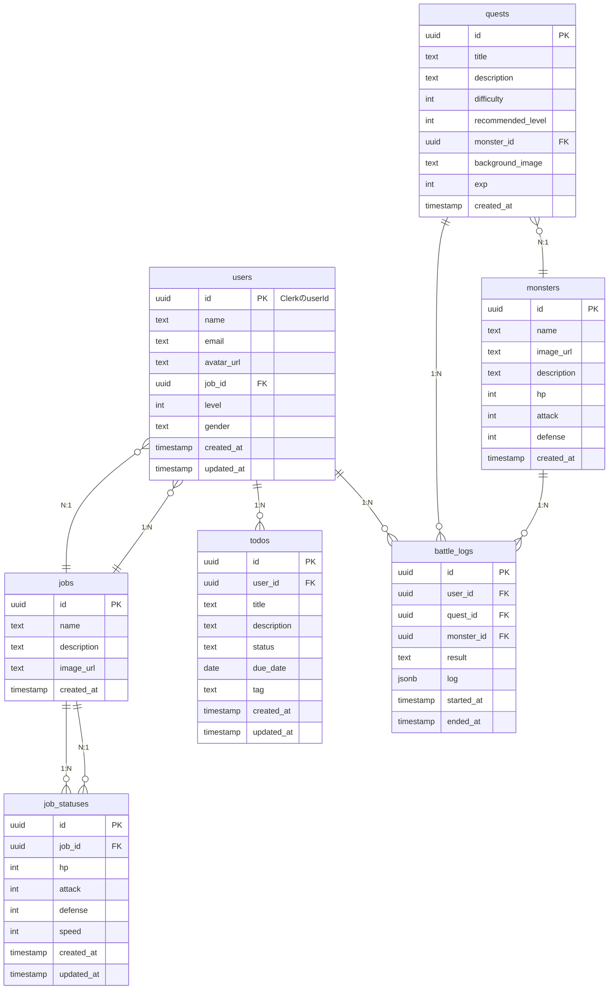

# RPG Todo アプリ テーブル設計

## ER 図

---

## テーブル定義

### users（ユーザー）

| カラム名   | 型        | 制約         | 説明             |
| :--------- | :-------- | :----------- | :--------------- |
| id         | uuid      | PK           | Clerk の userId  |
| name       | text      |              | 表示名           |
| email      | text      |              | メールアドレス   |
| avatar_url | text      |              | アイコン画像 URL |
| job_id     | uuid      | FK → jobs.id | 職業 ID          |
| level      | int       |              | レベル           |
| gender     | text      |              | 性別             |
| created_at | timestamp |              | 登録日時         |
| updated_at | timestamp |              | 更新日時         |

---

### jobs（職業）

| カラム名    | 型        | 制約 | 説明     |
| :---------- | :-------- | :--- | :------- |
| id          | uuid      | PK   | 職業 ID  |
| name        | text      |      | 職業名   |
| description | text      |      | 職業説明 |
| image_url   | text      |      | 画像 URL |
| created_at  | timestamp |      | 登録日時 |

---

### job_statuses（職業ごとのステータス）

| カラム名   | 型        | 制約         | 説明          |
| :--------- | :-------- | :----------- | :------------ |
| id         | uuid      | PK           | ステータス ID |
| job_id     | uuid      | FK → jobs.id | 職業 ID       |
| hp         | int       |              | HP            |
| attack     | int       |              | 攻撃力        |
| defense    | int       |              | 防御力        |
| speed      | int       |              | 素早さ        |
| created_at | timestamp |              | 作成日時      |
| updated_at | timestamp |              | 更新日時      |

---

### todos（タスク）

| カラム名    | 型        | 制約          | 説明        |
| :---------- | :-------- | :------------ | :---------- |
| id          | uuid      | PK            | タスク ID   |
| user_id     | uuid      | FK → users.id | ユーザー ID |
| title       | text      |               | タイトル    |
| description | text      |               | 説明        |
| status      | text      |               | ステータス  |
| due_date    | date      |               | 期限        |
| tag         | text      |               | タグ        |
| created_at  | timestamp |               | 作成日時    |
| updated_at  | timestamp |               | 更新日時    |

---

### quests（クエスト）

| カラム名          | 型        | 制約             | 説明          |
| :---------------- | :-------- | :--------------- | :------------ |
| id                | uuid      | PK               | クエスト ID   |
| title             | text      |                  | タイトル      |
| description       | text      |                  | 説明          |
| difficulty        | int       |                  | 難易度        |
| recommended_level | int       |                  | 推奨レベル    |
| monster_id        | uuid      | FK → monsters.id | モンスター ID |
| background_image  | text      |                  | 背景画像 URL  |
| exp               | int       |                  | 獲得経験値    |
| created_at        | timestamp |                  | 作成日時      |

---

### monsters（モンスター）

| カラム名    | 型        | 制約 | 説明          |
| :---------- | :-------- | :--- | :------------ |
| id          | uuid      | PK   | モンスター ID |
| name        | text      |      | 名前          |
| image_url   | text      |      | 画像 URL      |
| description | text      |      | 説明          |
| hp          | int       |      | HP            |
| attack      | int       |      | 攻撃力        |
| defense     | int       |      | 防御力        |
| created_at  | timestamp |      | 作成日時      |

---

### battle_logs（戦闘履歴）

| カラム名   | 型        | 制約             | 説明          |
| :--------- | :-------- | :--------------- | :------------ |
| id         | uuid      | PK               | 戦闘履歴 ID   |
| user_id    | uuid      | FK → users.id    | ユーザー ID   |
| quest_id   | uuid      | FK → quests.id   | クエスト ID   |
| monster_id | uuid      | FK → monsters.id | モンスター ID |
| result     | text      |                  | 勝敗など      |
| log        | jsonb     |                  | 戦闘詳細      |
| started_at | timestamp |                  | 開始日時      |
| ended_at   | timestamp |                  | 終了日時      |

---

## リレーションまとめ

- **users** 1:N **todos**（ユーザーは複数のタスクを持つ）
- **users** N:1 **jobs**（ユーザーは 1 つの職業を持つ）
- **users** 1:N **battle_logs**（ユーザーは複数の戦闘履歴を持つ）
- **jobs** 1:N **users**（職業は複数のユーザーに紐づく）
- **jobs** 1:N **job_statuses**（職業は複数のステータスを持つ）
- **job_statuses** N:1 **jobs**（ステータスは 1 つの職業に紐づく）
- **quests** 1:N **battle_logs**（クエストは複数の戦闘履歴を持つ）
- **quests** N:1 **monsters**（クエストは 1 体のモンスターに紐づく）
- **monsters** 1:N **battle_logs**（モンスターは複数の戦闘履歴を持つ）

---

このまま `schema.md` などのファイルとして保存してご利用ください。
ご要望に応じてカラムやリレーションの追加・調整も可能です。
